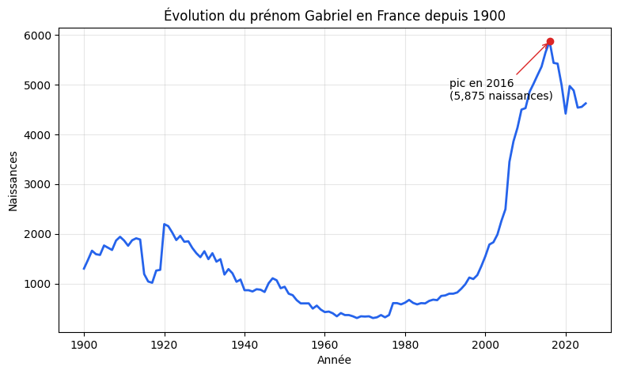
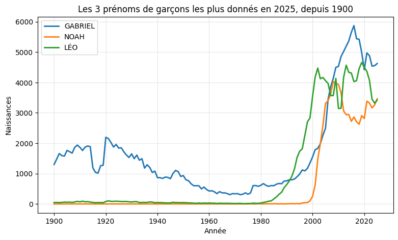
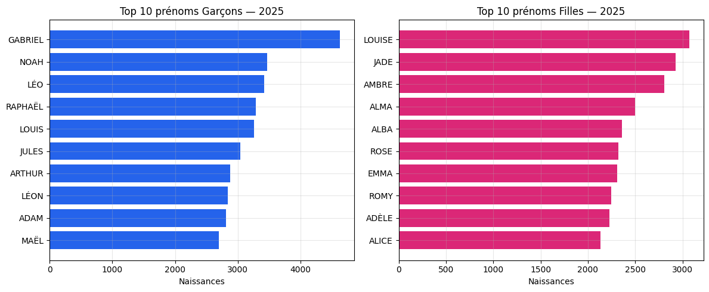

# Évolution des prénoms en France (1900–2025)


Exploration et visualisation du [fichier des prénoms de l'INSEE](https://www.insee.fr/fr/statistiques/8595130) :
tous les prénoms donnés en France depuis 1900, sous forme de notebook d'analyse
puis d'application web interactive.

## Aperçu

| Évolution d'un prénom | Comparaison de plusieurs prénoms | Palmarès d'une année |
|---|---|---|
|  |  |  |

Ces trois graphiques viennent du notebook d'exploration ; l'application
Streamlit permet de faire la même chose de façon interactive, pour n'importe
quel prénom.

## Stack technique

- **pandas** — chargement et agrégation des ~725 000 lignes du fichier INSEE
- **Jupyter** — exploration initiale, visualisations statiques (matplotlib)
- **Streamlit + Plotly** — application interactive, graphiques avec info-bulles
- **pytest** (+ `streamlit.testing.v1.AppTest`) — tests unitaires et
  d'intégration, y compris sur l'application Streamlit elle-même
- **GitHub Actions** — tests exécutés automatiquement à chaque push

## Structure du projet

```
prenoms-france/
├── app/
│   └── streamlit_app.py      # application interactive
├── notebooks/
│   └── 01_exploration.ipynb  # exploration initiale, visualisations
├── src/prenoms/
│   ├── data.py                # chargement et nettoyage du fichier INSEE
│   └── analysis.py            # évolution, comparaison, palmarès
├── tests/                     # tests unitaires (data, analysis) et
│                               # d'intégration (app)
├── data/raw/                  # fichier INSEE (non versionné, voir ci-dessous)
└── docs/img/                  # captures utilisées dans ce README
```

Le code d'analyse vit dans `src/prenoms/`, indépendant du notebook et de
l'application : les deux le réutilisent tel quel, plutôt que de dupliquer la
logique de chargement/agrégation à deux endroits.

## Installation

```bash
git clone https://github.com/GabicheL/prenoms-france.git
cd prenoms-france
python3 -m venv .venv
source .venv/bin/activate
pip install -r requirements.txt
```

Télécharge ensuite le fichier national des prénoms sur
[insee.fr/fr/statistiques/8595130](https://www.insee.fr/fr/statistiques/8595130)
(fichier `prenoms-2025-nat_csv.zip`), dézippe-le, et place le `.csv` obtenu
dans `data/raw/`. Ce fichier n'est pas versionné (4 Mo compressés, régulièrement
mis à jour par l'INSEE) : le README indique où le trouver plutôt que de le dupliquer.

## Utilisation

**Notebook d'exploration :**

```bash
jupyter lab notebooks/01_exploration.ipynb
```

**Application interactive :**

```bash
streamlit run app/streamlit_app.py
```

**Tests :**

```bash
pytest -v
```

Les tests sur `data.py` et `analysis.py` utilisent des données synthétiques et
tournent sans le fichier INSEE. Les tests de `app/streamlit_app.py`
nécessitent le fichier réel dans `data/raw/` et sont automatiquement ignorés
sinon (c'est pourquoi la CI GitHub Actions, qui n'a pas ce fichier, passe
quand même : elle couvre le cœur logique du projet).

## Choix techniques

- **Séparation logique / présentation** : `src/prenoms` ne dépend ni de
  Jupyter ni de Streamlit, ce qui le rend testable en isolation et réutilisable
  entre le notebook et l'application.
- **Schéma du fichier vérifié, pas supposé** : la documentation publique de
  l'INSEE ne détaillait pas le format exact des colonnes ; le code a été
  adapté et testé sur le vrai fichier plutôt que sur une hypothèse (voir
  l'historique de commits).
- **Le rang est fourni par l'INSEE et réutilisé tel quel** pour le palmarès,
  plutôt que recalculé — plus simple et fidèle à la méthodologie de l'INSEE.
- **Comparaison tolérante aux prénoms sans données** : `comparer_prenoms`
  affiche une courbe à zéro plutôt que de faire échouer toute la comparaison
  si un des prénoms n'a pas de données pour le sexe demandé.

## Pistes d'amélioration

- Ajouter le fichier par département (`prenoms-2025-dpt_csv.zip`) pour une
  vue géographique
- Mettre en cache les agrégations les plus courantes pour accélérer l'app sur
  de très gros volumes de recherches
- Déployer l'application sur Streamlit Community Cloud
- Ajouter une recherche approximative (tolérance aux fautes de frappe /
  accents) sur le champ prénom

## Licence

MIT — voir [LICENSE](LICENSE).
